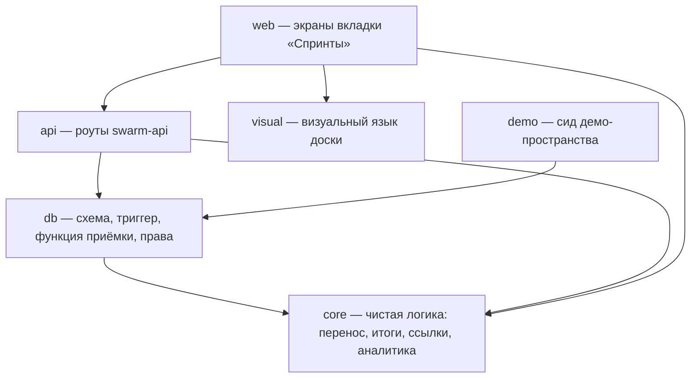

<!-- plan.md — HOW we build: stack, architecture, decomposition into blocks. Filled in during the spec and plan phase from the research report and the brainstorm; block agents read this file as the source of the contracts between blocks. -->

# Technical plan

<!-- Project name, date of agreement. -->

**Доска инициатив в «Спринтах» Swarm Brain**, 18.09.2026.

## Stack with rationale

<!-- Every technology choice comes with a "why", not just a name. Example: "PostgreSQL — relational data with a clear schema; the alternative (a document database) was considered and rejected — there are more relationships here than documents". -->

Стек не выбирается: фича встраивается в работающий продукт и берёт его стек целиком.

| Что | Чем | Почему именно так |
|---|---|---|
| Данные | Supabase Postgres 17 | продукт уже там; спринты #267 живут в `sprint_cycles`/`sprint_items`, механику не переписываем |
| Приёмка спринта | plpgsql-функция, вызов через `rpc` | запрос PostgREST — одна транзакция, блокировка строки держится до конца; нынешний `acceptCycle` делает шаги отдельными запросами и допускает половинчатую приёмку — ровно баг Plane [#9599](https://github.com/makeplane/plane/issues/9599) |
| Упоминание удалённой задачи | триггер `before delete on tasks` | задачи удаляет не только API: бот удаляет напрямую при работе со встречей. Код такой путь пропустит, триггер — нет. Проверено на локальной базе: `BEFORE DELETE` успевает до обнуления ссылки внешним ключом |
| Счётчик переносов | поле `carry_count` | рекурсивный обход `carried_from` считался бы на каждой отрисовке строки |
| Сервер | Deno Edge Functions, `supabase-js@2` | как весь Swarm; новые роуты — отдельными модулями, `swarm-api/index.ts` уже 2443 строки при пределе 800 (#265) |
| Веб | Next.js 16.2.6, React 19.2.4, Base UI, Tailwind 4 | как весь веб Swarm; свои выпадающие списки — через общий `ui/select`, нативные владелец отверг |
| Даты | строки `YYYY-MM-DD` + `Intl` с зоной Europe/Belgrade | `new Date('YYYY-MM-DD')` — полночь UTC, в паре с локальным форматированием даёт сдвиг дня; Temporal в Safari стабильно недоступен (D005) |

## Architecture

<!-- The top-level picture: which parts the system consists of and how they interact (in prose or as a diagram). Detailed enough to decide where the boundaries between blocks run. -->

Слои те же, что у продукта: база → чистая логика → роуты → экраны.

- **База** держит правила, которые нельзя доверить коду: один живой спринт на пространство (частичный
  уникальный индекс), атомарная приёмка (функция), упоминание удалённой задачи (триггер).
- **Чистая логика** (`_shared/tasks/`, `miniapp/src/lib/`) считает: кто уезжает и почему, итоги спринта,
  прогресс инициатив, семь таблиц аналитики, выгрузку. Здесь ошибка молчит — это ядро, тесты вперёд.
- **Роуты** `swarm-api` проверяют права, воркспейс и приватность, вызывают функцию приёмки и отдают данные.
  Прямых запросов к задачам мимо проверок нет: RLS без политик, замок только в коде.
- **Экраны** — вкладка «Спринты»: пространства, спринт (список и канбан), сверка, все инициативы,
  аналитика, журнал. Канбан #267 сохраняется как один из видов.

Сквозное правило: задача в спринте остаётся обычной задачей. Ни спринт, ни пространство не заводят
параллельной сущности задачи — только строку состава со снимком.

## Blocks and dependency graph

<!-- Every block is a logical unit of the product with its own spec (docs/furca/blocks/<name>.md), its own contract and its own working tree. The graph below says which block waits for another's contract to be ready (a real dependency, not merely "related").

A product with an interface must have a `visual` block: the shared visual system (grid, typography, colours, components, states) built from the screen reference in docs/furca/design/. It comes before the blocks that draw screens — otherwise every block invents its own button, and reconciling them afterwards costs more than agreeing up front. It is declared here, not added later: on a live project the block appeared only after the owner said he could not even test the product. -->

```mermaid
graph TD
  %% one node per block, an arrow means "depends on". Example: block_web --> block_api
```



`db --> core`: тест функции приёмки сверяет её результат с `planCarry` — логика переноса описана один раз
в TypeScript, SQL обязан ей совпадать.

## Contracts between blocks

<!-- For every pair of dependent blocks — exactly what one provides to the other: precise function signatures, endpoints, message formats, data schema. That is what allows blocks to be built in parallel without waiting for each other.

Every contract has an executable check on BOTH sides: the consumer verifies that it calls what was declared, the provider that it returns what was declared. Both live in their own blocks and turn red separately. Why: blocks are built in parallel by agents that cannot see each other, and otherwise a divergence surfaces at merge time — that is, for whoever did not introduce it. This is the very case contract testing was invented for (consumer-driven contracts); we do not bring in the broker machinery — both sides of the contract live in one repository. Basis: docs/research/2026-08-28-testing-industry.md. -->

**core → api, db, web** (`supabase/functions/_shared/tasks/`, чистые функции):

```ts
// sprint-carry.ts
export type CarryKind = "stay" | "manual" | "auto" | "mention";
export function planCarry(items: readonly SprintItemView[]): { id: string; kind: CarryKind }[];

// sprint-stats.ts (расширяется)
export function computeSprintStats(items: readonly SprintItemView[]): SprintStats;
//   + ключи carried_manual, carried_auto, check_ok, check_risk, check_problem, removed, cancelled
//   отменённая не входит ни в planDone, ни в знаменатель planPercent (D010)

// sprint-cycles.ts
export function nextCycleDates(prev: { start_date: string; end_date: string; name: string }):
  { start_date: string; end_date: string; check_date: string; name: string };

// links.ts
export function parseLinks(input: unknown): { title: string | null; url: string }[]; // бросает на негодном
```

**db → api** (SQL):

```sql
accept_sprint_cycle(p_cycle_id uuid, p_stats jsonb, p_next jsonb) returns jsonb
-- {next_cycle_id uuid, carried int, mentions int}; отказ — RAISE EXCEPTION (код P0001)
-- 23505 — параллельная приёмка или второй живой спринт
```
плюс поля §5 спеки, частичный уникальный индекс `uniq_sprint_cycles_live_per_tab`, триггер
`before delete on tasks`, гранты только `service_role`.

**api → web** (HTTP, `swarm-api`): `GET /sprint-cycles?tab_id=` · `POST /sprint-cycles` ·
`POST /sprint-cycles/:id/start` · `POST /sprint-cycles/:id/accept` · `DELETE /sprint-cycles/:id` (админ) ·
`GET|POST|DELETE /sprint-cycles/:id/items` · `PATCH /sprint-cycles/:id/items/:taskId` (сверка и перенос) ·
`GET /spaces/:tabId/journal?days=` · поля `links` у задач и `owner_telegram_id`/`start_date`/`end_date`
у проектов.

**visual → web**: строка задачи, плашка исполнителя с цветом, метки (перенос, сверка, «не отмечено»,
«×N», «просрочено», «удалена»), полоска прогресса, баннер, шкала ритуала, таблица аналитики, переключатель
вида — компонентами, а не копиями разметки в каждом экране.

**Проверка контракта с обеих сторон:** у `core` — тесты чистых функций; у `db` — тест функции приёмки на
локальной базе, сверяющий её результат с `planCarry`; у `api` — тесты гвардов (чужой воркспейс → 400,
второй живой спринт → 409, действия на принятом → 409, удаление не-админом → 403); у `web` — типы ответов
из общего `types.ts` и прогон экранов.

## Quality gates

<!-- How this project is checked by machine — one row per role. Six roles are mandatory: formatting, type-aware linting, type checking, tests with a coverage threshold, dead code, module boundaries. Tool sets per stack, and situational checks with their conditions for switching on, live in the admissio skill. -->

| Role | Command | Tool |
| --- | --- | --- |

| Формат | `deno fmt --check <файлы фичи>` | deno (встроено) |
| Линт с типами | `deno lint <файлы фичи>` | deno (встроено) |
| Проверка типов | `deno check <точки входа функций>` + `tsc --noEmit` в `miniapp/` | deno, TypeScript 5 |
| Тесты с порогом покрытия | `deno test --coverage` (два прогона: функции с типами, веб с `--no-check` — #383) + `scripts/gate-coverage.sh` | deno + свой гейт по lcov |
| Мёртвый код | `deno run -A scripts/check-graph.ts` | свой разбор импортов |
| Границы модулей | он же | свой разбор импортов |

Формат, линт, мёртвый код и границы действуют **на файлах фичи** (`scripts/feature-paths.txt`): замер
18.09.2026 показал 24 неотформатированных файла из 26 и 15 замечаний линта в существующем коде —
включать роли на весь репозиторий значит получить красный гейт на чужом коде и отключить правило.
Готового инструмента границ под Deno нет: `dependency-cruiser` молча пропускает URL-импорты и даёт ложное
«нарушений нет», поэтому разбор свой.

**Единая команда прогона:** `scripts/check` (она же `make check`).

**Машинный отчёт прогона:** `reports/check.json` — по строке на роль (`role`, `status`, `executed`,
`skipped`, `detail`), плюс JUnit XML обоих тестовых прогонов в `reports/tests-*.junit.xml`. Приёмка читает
отчёт, а не код возврата: пропущенная проверка и пустое покрытие считаются падением.

**Порча:** `make porcha` (`scripts/porcha`) — ломает каждый модуль ядра и требует, чтобы тесты упали;
отдельно краснеет, если подстановка не применилась.

<!-- Module boundaries are derived mechanically from the block graph above: a block imports only what it depends on in the graph; the reverse direction is forbidden. This is the only check that catches a violation invisible inside a single working copy and surfacing only at merge time. -->

**Single run command:** <path to an executable, for example `scripts/check`>

<!-- One entry point that runs the whole canonical set and writes the machine-readable report. Block acceptance calls it, the pre-push hook calls it, and CI calls it — all three the same one, otherwise they drift apart and "it's green on my machine" stops meaning anything. It is declared here machine-readably, not described in prose in the README. -->

**Machine-readable run report:** <format and the path the runner writes it to>

<!-- The report acceptance reads instead of the exit code: how many checks ran, how many were skipped and why. Every common runner can emit JUnit XML; a native JSON format works too. The format is declared here rather than hard-wired into the core: runners differ between projects. Not declared — acceptance has nothing to read, and the gate falls back to the exit code, which does not distinguish two hundred green checks from zero registered ones. -->

## Risks

<!-- Risk → mitigation. What can go wrong when integrating blocks, in the choice of stack, during deployment — and what to do if it happens. -->

| Риск | Что делаем |
|---|---|
| Половинчатая приёмка: снимок зафиксирован, хвосты не переехали (баг Plane #9599) | вся приёмка — одна plpgsql-транзакция с блокировкой строки; тест на локальной базе сверяет результат с `planCarry`; повторный вызов отбивается |
| Старый веб в ночь раскатки между функциями и вебом | `tab_id` необязателен, `GET /sprint-cycles` без параметра отдаёт всё как раньше; порядок раскатки миграция → функции → веб |
| Триггер удаления ошибётся и заблокирует удаление задачи | трогает только незамороженные строки состава этой задачи; тест на удаление через API и прямым `delete`; при отказе удаление задачи недоступно — проверяем до раскатки |
| Снятие «только админ» открывает создание спринтов демо-пользователю | демо изолировано барьером `isDemo` в воркспейсе `demo`; тест гварда |
| Перенос задваивает хвосты при гонке | уникальность `(cycle_id, task_id)` + `23505` ловится по коду ошибки, не по тексту |
| Supabase 30.10.2026 снимает автогранты на новые объекты | миграция прописывает `GRANT` явно (D006) |
| Правка `miniapp/` уедет на прод раньше времени: пуш в `main` пересобирает веб | работа только в ветке, вливание — ночным окном по «да» владельца |
| Файлы состояния FURCA столкнутся с двумя другими проектами в репозитории | в `main` они не вливаются до GarroV/furca#140 (D004) |
| Внутренние данные утекут в публичный репозиторий | артефакт и выгрузки живут в `workbench/private`; в git — ни строки (уже нарушалось 18.09.2026) |
