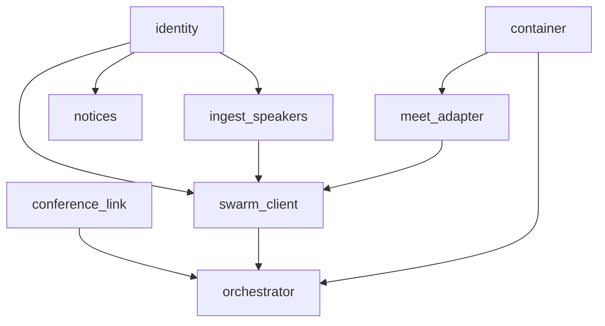

# Технический план — `scriba`

2026-09-17 · **Статус: ждёт утверждения владельцем на гейте**

## Стек с обоснованием

| Что | Выбор | Почему именно так |
|---|---|---|
| Язык бота | **TypeScript, Node 24 LTS** | сердце бота — Playwright, он живёт в экосистеме Node. Node 20 мёртв (EOL 30.04.2026 по официальному расписанию), поэтому 24. Перенос кода `bumblebee` отвергнут осознанно: переносимо 818 строк из 5451 (15%), переписать дешевле, чем тащить Swift-toolchain в Linux-контейнер |
| Браузер | **Playwright 1.63.0**, образ `mcr.microsoft.com/playwright:v1.63.0-noble` | официальный образ с Chromium 153. **Xvfb и PulseAudio в нём нет** — проверено по сырому Dockerfile, ставим сами |
| Экран | **Xvfb**, Chromium в **headed**-режиме | сходящаяся практика всех найденных ботов: headless чаще ломает звук и чаще палится детектом |
| Звук | **PulseAudio null-sink → ffmpeg → m4a/AAC** | совпадает с форматом, который `meeting-ingest` уже принимает. Рецепт взят у `screenappai/meeting-bot`: `XDG_RUNTIME_DIR`, `--exit-idle-time=-1`, поллинг готовности, обязательный `set-default-sink`, самопроверка monitor-source |
| Нарезка | **ffmpeg `segment` по времени** | у muxer'а `segment` **нет** опции нарезки по размеру в байтах — режем по `segment_time`, пересчитанному из битрейта AAC под лимит 25 МБ. `reset_timestamps` включаем руками, по умолчанию он выключен |
| Контейнеры | **dockerode** из Node | прецедент того же паттерна — `github/dependabot-action`. Оркестратор живёт **внутри WSL2** рядом с Docker: не пересекать границу Windows/WSL2 — меньше мест, где всё встанет незаметно |
| Сервер | **TypeScript/Deno**, существующий | продукт работает, его стек и есть ответ. Правки — только добавлением полей |

**Чего сознательно не берём:** Vexa/Attendee/Recall.ai как продукт (ни один не умеет Контур.Толк);
дорожки на каждого участника (решение D008); правку SDP ради экономии видео (трюк мёртв с Chromium
M138, у нас 153 — вместо него штатная настройка Meet «Audio only»).

**Лицензионная граница.** Из Vexa (Apache-2.0) код заимствуем с атрибуцией. Из Attendee
(Elastic License 2.0) — **не заимствуем**, только приёмы: репозиторий публичный и без файла лицензии.

## Архитектура

```
┌─ MUSPELHEIM (WSL2) ──────────────────────────────────────┐
│  orchestrator (Node, долгоживущий)                       │
│     └─ поднимает и гасит контейнеры, шлёт heartbeat      │
│                                                           │
│  ┌─ контейнер на ОДНУ встречу (эфемерный) ─────────────┐ │
│  │  Xvfb :99 · PulseAudio null-sink · Chromium · ffmpeg │ │
│  │  supervisor (Node): meet-adapter + swarm-client      │ │
│  └──────────────────────────────────────────────────────┘ │
└───────────────────────────────────────────────────────────┘
              │ HTTPS, Bearer-токен бота
              ▼
   Supabase Edge Functions (существующие, расширяются)
   meeting-current · -claim · -ingest · -heartbeat · -status
              │
              ▼
   существующий конвейер: транскрибация → тезисы → очередь вычитки
```

**Одна встреча = один контейнер.** Изоляция обязательна: PulseAudio-sink и дисплей — глобальные
ресурсы, два бота в одном контейнере запишут друг друга.

**Граница хрупкости.** Всё, что знает о вёрстке площадки, живёт только в адаптере. Остальной код
работает с интерфейсом `join(url, displayName)` / `waitAdmitted()` / `activeSpeaker()` / `isAlone()` /
`leave()` и о площадках не знает.

## Блоки и граф зависимостей

| Блок | Где | Что делает |
|---|---|---|
| `identity` | сервер | токен бота, подмена личности на входе, правки трёх эндпоинтов |
| `ingest-speakers` | сервер | приём таймлайна говорящих, сведение с сегментами |
| `conference-link` | сервер | площадка по хосту, `description` как источник, явная причина отказа |
| `container` | бот | образ, Xvfb, PulseAudio, ffmpeg, самопроверка звука |
| `meet-adapter` | бот | вход в Meet, дверь, активный говорящий, выход |
| `swarm-client` | бот | клиент пяти эндпоинтов, очередь выгрузки с ретраями |
| `orchestrator` | бот | жизненный цикл контейнеров, heartbeat |
| `notices` | сервер | уведомления владельцу встречи |



Стрелка означает «зависит от контракта». `identity` — корень: без него ни один серверный вызов бота
не проходит, поэтому он строится первым.

## Контракты между блоками

### `identity` → всем, кто ходит на сервер

```ts
// _shared/agent-auth.ts
export type TokenKind = "recorder" | "recorder_prev" | "mcp" | "bot";
export interface AgentIdentity { telegramId: number; groupId: string | null; kind: TokenKind }

// Подмена личности ОДИН раз на входе: после неё весь существующий код не знает, что пришёл бот.
export async function resolveActingIdentity(
  supabase: SupabaseClient, req: Request, onBehalfOf?: number,
): Promise<AgentIdentity>;
```

Правила, проверяемые тестами с обеих сторон:
- `kind: "bot"` **обязан** передать `on_behalf_of`, иначе прав нет ни на что;
- `kind: "recorder"` передать `on_behalf_of` **не может** — 403;
- указанный человек обязан существовать, быть активным и быть в том же воркспейсе, что встреча;
- на выходе `telegramId` — **человек**, не бот: `claim_owner` и `owner_id` остаются человеческими.

### `ingest-speakers` → `swarm-client`

```jsonc
// поле speakers формы meeting-ingest: необязательное, времена в секундах от начала записи
[{ "start": 0.0, "end": 12.4, "name": "Василий Гарро" }]
```

- нет поля → поведение ровно нынешнее (`sys` → «собеседник»), **мягкая деградация**;
- имя подставляется в `Segment.speaker` по перекрытию интервалов;
- перекрытия и дыры разрешены: не нашли имя на сегмент — оставляем прежнюю метку.

### `conference-link` → `orchestrator`

```ts
// ответ meeting-current, дополнительно к существующему join_url
{ join_url: string | null, platform: "meet" | "kontur" | "zoom" | null, reason?: "no_conference_link" }
```

### `container` → `meet-adapter`

Готовое окружение: `DISPLAY=:99`, PulseAudio с null-sink и **проверенным** monitor-source, ffmpeg в
`PATH`, Chromium запускается с `ignoreDefaultArgs: ['--mute-audio']`.

### `meet-adapter` → `swarm-client`

```ts
export interface PlatformAdapter {
  join(url: string, displayName: string): Promise<void>;
  waitAdmitted(timeoutMs: number): Promise<"admitted" | "denied" | "timeout" | "captcha">;
  activeSpeaker(): Promise<string | null>;
  isAlone(): Promise<boolean>;
  leave(): Promise<void>;
}
```

## Проверки качества

Шесть обязательных ролей. Стека два, поэтому по две строки на роль.

| Роль | Команда | Чем |
|---|---|---|
| Формат | `prettier --check bot/` · `deno fmt --check supabase/` | Prettier с дефолтами · встроено в Deno |
| Линт с типами | `eslint bot/` · `deno lint supabase/` | ESLint 10 flat config, `typescript-eslint` `strictTypeChecked` + `stylisticTypeChecked`, `sonarjs`, `unicorn`, `depend` · встроено |
| Типы | `tsc --noEmit -p bot/` · `deno check` изменённых функций | строгий tsconfig, `noUncheckedIndexedAccess` включить **до** появления кода |
| Тесты и порог | `vitest run --coverage` · `deno test --coverage=cov` + `scripts/gate-coverage.sh` | у `deno coverage` **нет** флага порога — считаем по lcov (`LF`/`LH`), пустой отчёт = красный |
| Мёртвый код | `knip` (бот) | для Deno готового аналога нет — роль закрыта только на стороне бота, это осознанный пробел |
| Границы модулей | `depcruise bot/` | правило выводится из графа выше: блок импортирует только то, от чего зависит; обратное направление запрещено |

**Карантин свежих версий:** `min-release-age=7` в `bot/.npmrc` — ставится с первой установкой
зависимостей, вместе с установкой из лока в CI, иначе обходится сам собой.

**Единая команда прогона:** `scripts/check` — исполняемый файл в репозитории. Её зовут приёмка блока,
хук `pre-push` и CI: одна точка входа, иначе «на моей машине зелено» перестаёт что-либо значить.

**Машинный отчёт прогона:** JUnit XML в `reports/check.xml`. Приёмка читает **его**, а не код
возврата: код одинаков и при двухстах выполненных проверках, и при нуле зарегистрированных.

**Хук:** `.githooks/pre-push` зовёт `scripts/check`; включается `git config core.hooksPath .githooks`.
Хук **обязан падать, когда инструмента нет**, а не пропускать проверку молча. В репозитории уже есть
`.githooks/pre-commit` с `deno check` — он остаётся, `pre-push` добавляется рядом.

## Риски

| Риск | Что делаем |
|---|---|
| 🔴 **Звук пишется как тишина** (`--mute-audio` по умолчанию) | `ignoreDefaultArgs`, самопроверка monitor-source при старте, **смоук, который падает на тишине**. Это единственный риск, который не виден в логах вообще |
| 🔴 **Google блокирует бота** | не ставить `--ignore-certificate-errors`, движения мыши синтетические, вход под аккаунтом при повторных блокировках. Домашний IP MUSPELHEIM здесь преимущество: банят прежде всего датацентровые |
| 🟡 **Вёрстка Meet меняется** | селекторы по `aria-label`/`role`, пиннинг локали (`?hl=en` + `--lang=en-US`), вся вёрстка — только в адаптере |
| 🟡 **Регресс у `bumblebee`** | все правки эндпоинтов — добавлением полей; регрессный прогон рекордера в DoD каждого серверного блока |
| 🟡 **MUSPELHEIM лёг** | приемлемо, пока бот работает параллельно с `bumblebee`: не записал бот — записал человек. Как только бот станет единственным источником, переезд обязателен |
| 🟡 **Запас памяти площадки** | замер 17.09: свободно ~9.3 ГиБ против 13.5 в спеке. Боту нужно ~2.4 ГБ в пике. Площадка общая — следить при росте чужих проектов |
| 🟢 **Двойная оплата OpenAI** | принято владельцем (D006) на время проверки |
